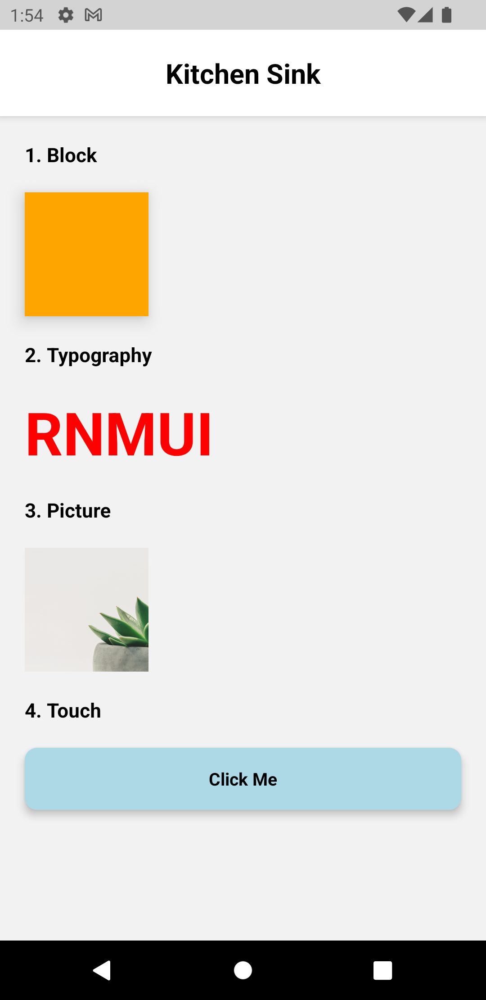

# rnmuilib

[](https://www.npmjs.com/package/rnmuilib)
[](https://www.npmjs.com/package/rnmuilib)
[](https://www.npmjs.com/package/rnmuilib)
[](https://github.com/fateh999/rnmuilib/blob/master/LICENSE)

React Native Minimalistic UI Library with barebones components to easily create any UI you want

#### Documentation :

- [https://fateh999.github.io/rnmuilib](https://fateh999.github.io/rnmuilib)

#### Demo :




#### Web Demo :

<div data-snack-id="@fateh999/rnmuilib" data-snack-platform="web" data-snack-preview="true" data-snack-theme="light" style="overflow:hidden;background:#F9F9F9;border:1px solid var(--color-border);border-radius:4px;height:505px;width:100%"></div>
<script async src="https://snack.expo.dev/embed.js"></script>

#### Steps to install :

```javascript

npm install rnmuilib

```

or

```javascript

yarn add rnmuilib

```

```javascript
import { Block, Typography, Picture } from "rnmuilib";
```

#### Usage :

```javascript
import React from "react";
import { ScrollView, StyleSheet } from "react-native";
import { Block, Typography, Picture, Container } from "rnmuilib";

function App() {
  return (
    <Container backgroundColor={"#f2f2f2"}>
      <Block backgroundColor={"white"} elevation={5}>
        <Typography
          fontSize={22}
          color={"black"}
          fontWeight={"bold"}
          textAlign={"center"}
          marginVertical={20}
        >
          Kitchen Sink
        </Typography>
      </Block>
      <ScrollView
        style={styles.scrollView}
        showsVerticalScrollIndicator={false}
      >
        <Block marginHorizontal={20}>
          <Typography
            fontSize={16}
            color={"black"}
            fontWeight={"bold"}
            marginVertical={20}
          >
            1. Block
          </Typography>
          <Block
            backgroundColor={"orange"}
            height={100}
            width={100}
            elevation={10}
          />
        </Block>

        <Block marginHorizontal={20}>
          <Typography
            fontSize={16}
            color={"black"}
            fontWeight={"bold"}
            marginVertical={20}
          >
            2. Typography
          </Typography>
          <Typography fontSize={48} fontWeight={"bold"} color={"red"}>
            rnmuilib
          </Typography>
        </Block>

        <Block marginHorizontal={20}>
          <Typography
            fontSize={16}
            color={"black"}
            fontWeight={"bold"}
            marginVertical={20}
          >
            3. Picture
          </Typography>
          <Picture
            height={100}
            width={100}
            source={{
              uri: "https://images.pexels.com/photos/305821/pexels-photo-305821.jpeg?cs=srgb&dl=pexels-scott-webb-305821.jpg&fm=jpg",
            }}
          />
        </Block>
      </ScrollView>
    </Container>
  );
}

export default App;

const styles = StyleSheet.create({
  scrollView: { flexGrow: 1 },
});
```

<p><a href="https://www.buymeacoffee.com/fateh999"> </a></p><br><br><br>
